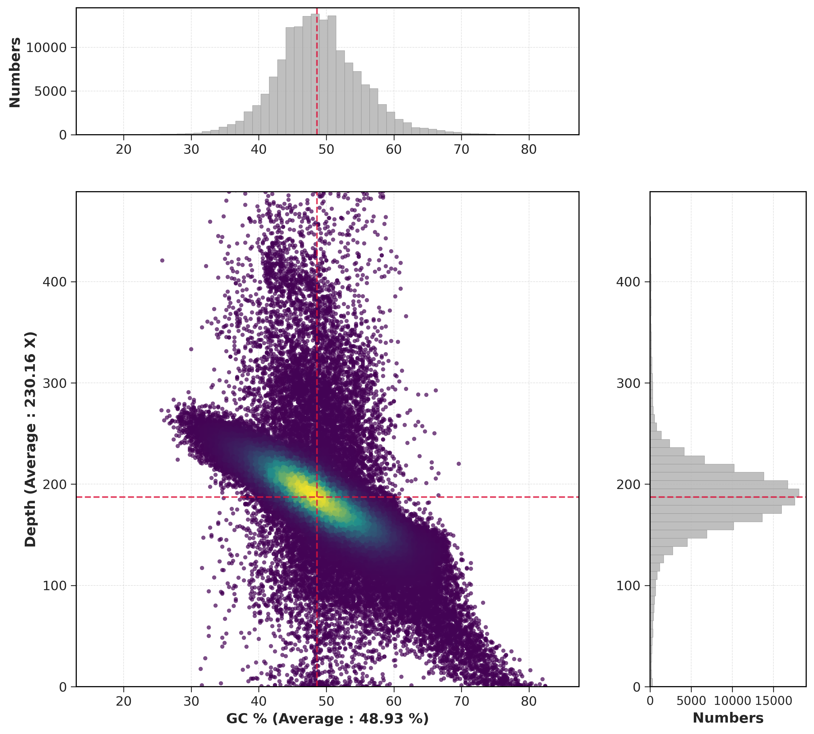

# GC-depth visualization


GC depth visualization is one of the robust methods to identify contaminants in the genome. Since every taxon/species has different GC content, visualizing GC content with sequencing depth information can identify whether a genome has a contaminant or not. Contaminant are always present in low sequencing depth and has different GC content with the host genome. Many published paper have already implemented GC-depth visualization, but none of them have published the script to visualized it. So, here I present a Python script to compute and visualize GC content vs sequencing depth per genomic window.



## 1. Install
This script uses 3 common python libraries, including `numpy`, `matplotlib`, and `scipy`. Make sure all of those libraries are already installed in your system.
```bash
pip install matplotlib numpy scipy
```

### (1) Clone this repository
```bash
git clone https://github.com/dedee95/GC-depth.git
cd GC-depth/
python gc-depth-plot.py -h
```
### (2) Direct download from Github
You can just download the corresponding script `gc-depth-plot.py` and directly use it. 

After downloading the script, you can type the help message (`-h` or `--help`) to see if the script is working.
```bash
$ python gc-depth-plot.py -h
Compute and visualize GC content vs sequencing depth per genomic window. One of rebust way to identify contamination in the genome.

Usage: gc-depth-plot.py <fasta> <pandepth_output> [options]

Positional arguments:
  fasta                Genome FASTA file (gzipped is also fine)
  pandepth             Pandepth windowed depth file (.win.stat.gz)

Options:
  -h, --help           Show this help message and exit
  -w, --window WINDOW  Window size, must match pandepth -w value (default: 1000)
  -o, --output OUTPUT  Output plot file (.png or .pdf, default: gc-depth.png)
  --log-depth          Use logarithmic scale for the depth axis
  --plot-only TSV      Skip processing, re-plot from an existing combined TSV (from --output-data)
  --output-data FILE   Save merged GC and depth data to this TSV file (can be reused with --plot-only)
```

## 2. Usage step by step 
There are several upstream steps that you must do before running `gc-depth-plot.py`. The main purpose of the initial step is to generate sequencing depth information in a specific window size.
### 2.1 Align raw reads to the genome
**Short reads (Illumina or BGI/MGI-seq)**
```bash
bwa index genome.fa
bwa mem -t 30 genome.fa reads_1.fq.gz reads_2.fq.gz > aligned.sam
```

**PacBio HiFi reads**
```bash
minimap2 -ax map-hifi -t 30 genome.fa reads.fq.gz > aligned.sam
```

**Long reads (ONT or Cyclone-seq)**
```bash
minimap2 -ax map-ont -t 30 genome.fa reads.fq.gz > aligned.sam
```

### 2.2 Process the SAM file into sorted BAM file
```bash
samtools view -Sb --threads 30 -o aligned.bam aligned.sam
samtools sort --threads 30 -o aligned.sorted.bam aligned.bam
samtools index aligned.sorted.bam
```

### 2.3 Run Pandepth to get depth information
The `-w` value here must match the `--window` value you pass to `gc-depth-plot.py`. Read more about [Pandepth](https://github.com/HuiyangYu/PanDepth).
```bash
pandepth -i aligned.sorted.bam -w 1000 -o depth
```

After successfully running Pandepth, you will get the output file: `depth.win.stat.gz`. Use this file and `genome.fa` file as `gc-depth-plot.py` input file.

### 2.4 Run `gc-depth-plot.py`
```bash
python gc-depth-plot.py genome.fa depth.win.stat.gz -w 1000
```
The default output file is `gc-depth.png`, If you want to change the output file as `.pdf`, you can just specify the output `-o` parameter to `-o output.pdf`.

## 3. Example
To get more familiar with the function of this script, I will demonstrate a real-world example of GC-depth visualization. Here, I use genome data from the red algae species _Agarophyton chilense_ (_Gracilaria chilensis_). I downloaded the genomic data and raw reads from [NCBI](https://www.ncbi.nlm.nih.gov/datasets/genome/GCA_030374765.1/):
```
# genomic data
wget https://ftp.ncbi.nlm.nih.gov/genomes/all/GCA/030/374/765/GCA_030374765.1_ASM3037476v1/GCA_030374765.1_ASM3037476v1_genomic.fna.gz

# WGS raw reads
parallel-fastq-dump --sra-id SRR23519128 --threads 20 --outdir SRR23519128_reads --split-files --gzip

# map the raw reads to the genome
bwa index Gracilaria_chilensis.genome.fa
bwa mem -t 12 Gracilaria_chilensis.genome.fa Gracilaria_chilensis_WGS_1.fq.gz Gracilaria_chilensis_WGS_2.fq.gz > Gchilensis.aln.sam  
samtools view -Sb --threads 12 -o Gchilensis.aln.bam Gchilensis.aln.sam  
samtools sort --threads 12 -o Gchilensis.aln.sorted.bam Gchilensis.aln.bam  
samtools index Gchilensis.aln.sorted.bam

# run pandepth
pandepth -i Gchilensis.aln.sorted.bam -w 500 -o depth # output: example/depth.win.stat.gz

#run the python script
python gc-depth-plot.py Gracilaria_chilensis.genome.fa depth.win.stat.gz -w 500
```

Here is the final GC-depth plot output from the Python script.


Based on this figure, it is clear that there is no contamination in the genome. There is **only one distinct GC peak and depth**. If contamination were present, the figure would show more than one peak in GC content and average depth (top and right panels). Additionally, there would be multiple GC content densities in the main scatter plot. For more details on GC-depth use cases, read my Medium article.

## 4. Discussing
I will keep updating this repository. If you have any questions, fell free to reach me.

- Linkedin: https://www.linkedin.com/in/dede-kurniawann/
- E-mail: dedekurniawan@genomics.cn or dedearkun2710@gmail.com


